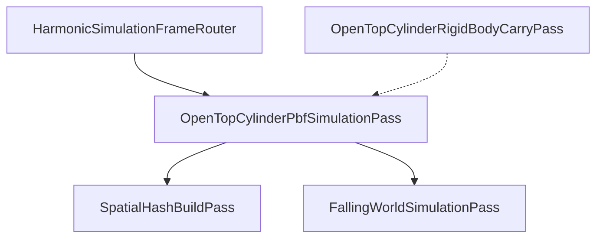

# Advanced Harmonic Engine V3

GPU-resident fluid simulation for the swinging paint bucket VR project.

## Module index

| Folder | README |
|--------|--------|
| [Core/](Core/README.md) | Validation, limits, shared data structures |
| [Domain/](Domain/README.md) | Fluid models, solvers, profiles |
| [Infrastructure/Management/](Infrastructure/Management/README.md) | `HarmonicPipelineController`, GPU pools, spawn |
| [Infrastructure/Management/SimulationPasses/](Infrastructure/Management/SimulationPasses/README.md) | Per-frame simulation passes |
| [Infrastructure/ComputeShaders/](Infrastructure/ComputeShaders/README.md) | PBF, WCSPH, spatial hash, boundaries |
| [Infrastructure/Rendering/](Infrastructure/Rendering/README.md) | Screen-space fluid rendering |
| [Infrastructure/PlaybackStreaming/](Infrastructure/PlaybackStreaming/README.md) | Bake, playback, debug draw |
| [Diagnostics/](Diagnostics/README.md) | Run manifests, telemetry, readback |

## Frame graph (container + PBF)

## Glossary (post-refactor)

| Old | New |
|-----|-----|
| `PipelineExecutionController` | `HarmonicPipelineController` |
| `ContainerFluidSettings` | `OpenTopCylinderSettings` |
| `containerFluid` | `openTopCylinder` |
| `usePBF` | `openTopCylinderUsePbf` |
| `spillOverRim` | `transferExteriorParticlesToFalling` |
| `streamCompactionShader` | `wcsphDensityShader` |
| `_GradSqSum` spill hack | `spillTransferFlags` |

See [docs/architecure.md](../../docs/architecure.md) for the original architecture spec.
