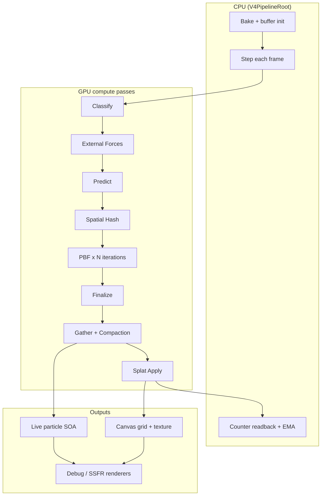

# 1 — Overview

## Purpose

HarmonicEngineV4 simulates **paint-like fluid** as thousands to millions of GPU particles inside a cylindrical bucket. The bucket can move, tilt, and spin (VR or keyboard lab). Fluid:

- Sloshes and coheres (PBF + viscosity + cohesion)
- Escapes through **holes** in the bucket floor/walls via a zone system
- Falls onto a **canvas** below and accumulates as paint splats
- Is rendered as particle debug view or **screen-space fluid** (SSFR)

The engine is designed to be **deterministic**, **testable**, and **manifest-driven**: every GPU pass is declared in a pass manifest, validated at init, and executed through a single executor.

---

## Design principles

| Principle | What it means in V4 |
|-----------|---------------------|
| **GPU-first** | Positions, velocities, flags, and most logic run on compute shaders. CPU holds references, bake math, and small readbacks. |
| **CPU reference + HLSL mirror** | Geometry, zones, flags, splat math exist as C# reference code with one-to-one HLSL copies. Parity tests keep them aligned. |
| **Single classification authority** | Only `ClassifyKernel` sets inside/outside, zones, and the permanent escape latch each frame. |
| **Containment ≠ classification** | Wall/floor collision uses **geometry** (`ShouldContainInside`), not the Inside flag. The flag drives carry and zone forces. |
| **Deterministic lifecycle** | Compaction sort + splat apply order are stable across runs with the same inputs. |
| **Manifest UAV budget** | Each pass binds ≤ 8 RW buffers (D3D11 limit). Validated at startup. |

---

## V3 vs V4

| | **V3** (`AdvancedHarmonicEngine_V3`) | **V4** (`HarmonicEngineV4`) |
|---|--------------------------------------|------------------------------|
| Status | Legacy / game-integrated | Active lab engine |
| Orchestration | `HarmonicPipelineController` + pass classes | `V4PipelineRoot` + `V4PassManifest` |
| Bucket model | Open-top cylinder boundary HLSL | Bucket-local zones + hole escape latch |
| Canvas | Hit detection bridges | GPU canvas grid + splat events |
| Classification | Container inside/outside | Inside + zones + permanent escape |
| Tests | Under `Assets/Tests/` | Under `Assets/HarmonicEngineV4/Tests/` |

New feature work for the paint-bucket experience should target **V4** unless explicitly integrating with legacy V3 game code.

---

## Glossary

| Term | Definition |
|------|------------|
| **SOA** | Structure of Arrays — separate GPU buffers for position, velocity, color, flags |
| **PBF** | Position-Based Fluids — density constraint solver (Macklin & Mueller style) |
| **Smoothing radius `h`** | SPH kernel radius = `4 × particleRadius` |
| **Rest density ρ₀** | Target density for PBF constraint; numerically calibrated to spawn lattice |
| **Inside flag** | Recomputed each frame: particle in open cavity (`0 ≤ y ≤ height`, `r ≤ innerRadius`) |
| **Escape latch** | Permanent flag set when particle enters Hole Zone 0; never re-enters bucket logic |
| **Zone** | Hole ring (0/1/2) or top band — drives per-frame forces |
| **Containment** | Geometric wall/floor collision independent of Inside flag |
| **Compaction** | Remove settled/impact-absorbed particles; shrink live count |
| **Splat event** | GPU record of a paint deposit on the canvas grid |
| **EMA loss** | Exponential moving average of per-hole ejection counts → top-band push-down |

---

## High-level data flow

---

## Next steps

- [Architecture](02-architecture.md) — module layout and core infrastructure
- [Getting started](15-getting-started.md) — run the lab scene
