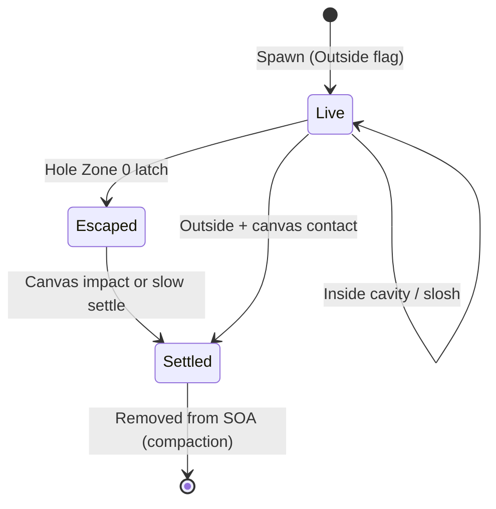

# 4 — Data model

All GPU particle state and supporting structures used by HarmonicEngineV4.

---

## Particle SOA

Managed by `V4ParticleSoa`. Capacity fixed at init from spawn bake count.

| Buffer | Type | Content |
|--------|------|---------|
| `_Block0` | `float4` | `xyz` = world position, `w` = particle radius |
| `_Block1` | `float4` | `xyz` = world velocity, `w` = unused |
| `_PackedColors` | `uint` | RGBA8 packed color |
| `_Flags` | `uint` | Bitfield (see below) |

Each has a `_Write*` counterpart for Finalize staging. Aliases registered in `V4BufferRegistry`:

- `_PackedColorsRead` — read-only color for PBF neighbor pass
- `_PredictedRead` — Finalize reads final predicted positions
- `_StageBlock0/1`, `_StageColors`, `_StageFlags` — compaction staging
- `_GatherBlock0/1`, `_GatherColors`, `_GatherFlags` — Gather targets (= read set)

---

## Particle flags

CPU: `V4ParticleFlags` · GPU: `V4Common.hlsl` macros

| Bits | Field | Notes |
|------|-------|-------|
| 0 | **Inside** | Recomputed every frame by Classify |
| 1 | **hasEscaped** | Permanent latch; only Classify sets it |
| 2–4 | **Zone** | `None`, `HoleZone0/1/2`, `TopBand` |
| 5–9 | **Hole index** | Owning hole (0–31) |
| 10–17 | **Profile index** | Liquid profile (0–255) |

Spawn default: Outside, not escaped, profile index from zone's profile or global fallback.

```csharp
V4ParticleFlags.IsInside(flags);
V4ParticleFlags.HasEscaped(flags);
V4ParticleFlags.GetZone(flags);
V4ParticleFlags.GetProfile(flags);
```

---

## Counters buffer

40 `uint` slots (`V4Counters`). Shared C#/HLSL layout.

| Slot | Name | Cleared each frame? | Purpose |
|------|------|---------------------|---------|
| 0 | `WriteCount` | Yes | Survivors after compaction |
| 1 | `EscapedTotal` | No | Cumulative escaped particles |
| 2 | `SettledTotal` | No | Cumulative removed to canvas |
| 3 | `TopBandCount` | Yes | Particles in top band this frame |
| 4 | `SplatEventCount` | Yes | Splat events emitted this frame |
| 8–39 | `EjectedPerHoleBase + i` | Yes (32 slots) | Per-hole Zone-0 eject count this frame |

`ReadBackCounters()` sync-reads all 40 slots each frame (small stall, acceptable at lab scale).

---

## Liquid profiles

**Authoring:** `V4LiquidProfile` ScriptableObject  
**GPU:** `V4GpuProfileData` struct (17 floats, 68 bytes) in `_Profiles` buffer

| Field | Source property | Used by |
|-------|-----------------|---------|
| `restDensity` | `restDensity` × lattice calibration | PBF lambda |
| `viscosity` | `viscosity` | Finalize XSPH |
| `cohesion` | `cohesion` | Finalize surface tension |
| `colorDiffusionRate` | `colorDiffusionRate` | ApplyDelta color lerp |
| `settleEpsilon` | `settleEpsilon` | Finalize slow settle |
| `canvasMaxDepth` | `canvasMaxDepth` | SplatApply depth cap |
| `surfaceFriction/Restitution` | bucket surface | Finalize collision |
| `zoneStrength0/1/2` | `zoneStrengthByLevel` keys 0–2 | ExternalForces |
| `topBandScale` | key 3 | ExternalForces top band |
| `impactAbsorbSpeed` | impact threshold | Finalize impact splat |
| `impactSplashScale` | splash size scale | Finalize splat radius/depth |
| `pbfKCorr` | artificial pressure strength | SolveDelta s_corr |
| `pbfNCorr` | artificial pressure exponent | SolveDelta s_corr |
| `pbfDeltaQScale` | reference distance as fraction of h | SolveDelta s_corr |

Profile table built at init: global profile + unique profiles from spawn zones.

---

## Holes (baked)

**Authoring:** `V4HoleDef` on `V4Bucket.holes`  
**Runtime:** `V4BakedHole[]` → GPU `V4Hole` struct (48 bytes)

```
localPosition (float3), radius (float)
outwardNormal (float3), d0, d1, d2, pad0, pad1
```

Ring radii from bake:

- `d0 = max(holeRadius, ringSpacing × 0.25)`
- `d1 = d0 + ringSpacing`
- `d2 = d1 + ringSpacing`

Max 32 holes. Bake validates spacing and can auto-shrink overlapping rings.

---

## Scratch buffers (per frame)

| Buffer | Purpose |
|--------|---------|
| `_Predicted` | Predicted positions for PBF |
| `_Densities` | Poly6 density per particle |
| `_Lambdas` | PBF constraint multipliers |
| `_Deltas` | Jacobi position corrections |
| `_BlendedColors` | Neighbor color accumulation (xyz = sum, w = weight) |
| `_CompactionPairs` | `uint2(sortKey, sourceIndex)` for removal sort |
| `_SplatEvents` | Up to `maxSplatEvents` per frame |
| `_GridKeyValueBuffer` | Spatial hash (hash, index) pairs |
| `_CellStartEndBuffer` | Cell range start/end in sorted keys |
| Sort temps | Radix sort ping-pong for hash and compaction |

---

## Canvas grid

| Property | Value |
|----------|-------|
| Buffer | `_CanvasGrid` |
| Cell layout | `float4(rgb, depth)` per cell |
| Cell size | `ParticleRadius` (world meters) |
| Dimensions | `CanvasGridSize` from canvas width/depth |
| Texture | `RenderTexture` on pipeline, updated by `CanvasToTextureKernel` |

Depth uses saturating blend capped by profile `canvasMaxDepth`.

---

## Splat events

```csharp
struct V4SplatEvent {
    float2 uv;           // meters from canvas min corner
    float radius;
    float contribution;  // paint depth added
    uint color;          // RGBA8
    uint pad0;           // source particle index (deterministic sort key)
}
```

Emitted in `FinalizeKernel` when:

1. **Impact absorption** — outside particle, fast downward hit on canvas rect
2. **Slow settle** — outside particle, near plane, low velocity

Consumed by `SplatApplyKernel` (single-threaded, sorted by `pad0`).

---

## Particle lifecycle



Conservation invariant: `SpawnedTotal == ActiveParticleCount + SettledTotal` (escaped particles that settle are counted in SettledTotal; live count excludes removed).

---

## Related

- [Bucket & zones](05-bucket-and-zones.md)
- [Canvas & splats](08-canvas-and-splats.md)
- [Configuration](11-configuration.md)
