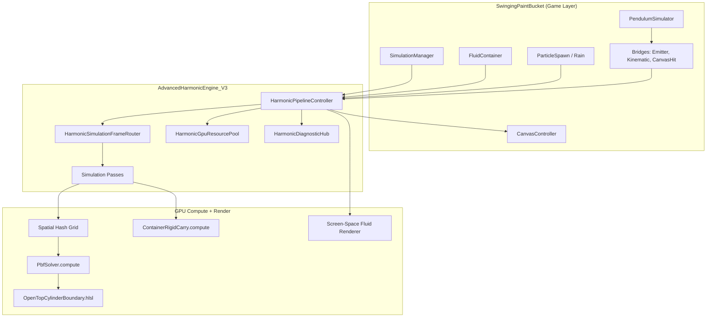
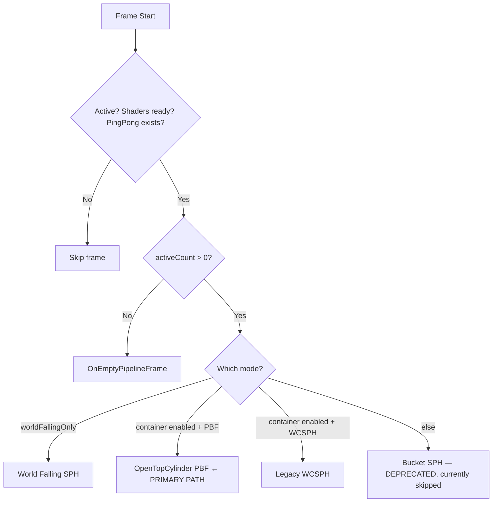
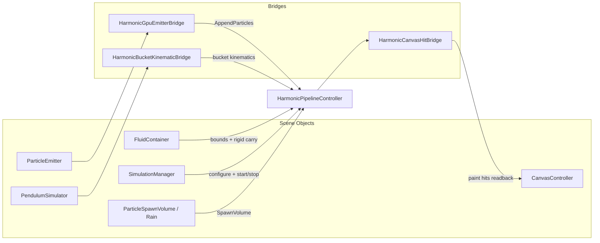

# VR Swinging Paint Bucket — Engine & Pipeline Overview

Shareable overview of how the project is organized, what runs each frame, and how the game layer talks to the GPU fluid engine.

---

## What This Project Does

A **Unity VR paint-bucket experience** where fluid is simulated as **millions of GPU particles** (SPH / PBF). A swinging bucket holds paint; when it tilts or spins, fluid sloshes, spills, and can hit a canvas below. The simulation runs almost entirely on the GPU; the CPU only orchestrates, spawns particles, and reads back paint hits.

**Two main codebases live under `Assets/`:**

| Layer | Folder | Role |
|-------|--------|------|
| **Engine (current)** | `HarmonicEngineV4/` | GPU PBF fluid simulation — bucket zones, holes, canvas splats, deterministic compaction |
| **Engine (legacy)** | `AdvancedHarmonicEngine_V3/` | Earlier GPU fluid framework (SPH/PBF hybrid) |
| **Game** | `SwingingPaintBucket/` | Bucket, pendulum, canvas, scene wiring |

> **HarmonicEngineV4** is the active simulation engine for new work. Full documentation: [`Assets/HarmonicEngineV4/Docs/README.md`](../Assets/HarmonicEngineV4/Docs/README.md) (bucket geometry, PBF solver, GPU shaders, testing, parity invariants).

---

## High-Level Architecture



**Central idea:** `HarmonicPipelineController` owns all GPU buffers and shaders. Everything else feeds it configuration (container bounds, spawn data, bucket motion) or consumes its output (rendering, canvas paint hits).

---

## File Structure

```
Assets/
├── AdvancedHarmonicEngine_V3/          ← THE ENGINE
│   ├── Core/                           Math, integrators, validation manifest
│   ├── Domain/                         CPU models, fluid profiles, SPH math
│   ├── Infrastructure/
│   │   ├── Management/                 HarmonicPipelineController + GPU pools
│   │   │   ├── Gpu/                    Buffer pool, shader property IDs
│   │   │   └── SimulationPasses/     Per-frame pass classes
│   │   ├── ComputeShaders/             PBF, WCSPH, spatial hash, rigid carry
│   │   │   └── Include/                Shared HLSL (boundaries, neighbor query)
│   │   ├── Rendering/                  Screen-space fluid renderer
│   │   └── PlaybackStreaming/          Bake record/playback, debug draw
│   ├── Diagnostics/                    Logging hub, telemetry, GPU readback
│   └── Testing/                        Test settings assets
│
├── SwingingPaintBucket/                ← THE GAME
│   ├── Scripts/
│   │   ├── Simulation/                 SimulationManager, controls, timeline
│   │   ├── Scene/                      FluidContainer, rain director, mesh builder
│   │   ├── Bucket/                     BucketController, keyboard control
│   │   ├── Pendulum/                   PendulumSimulator (RK4 physics)
│   │   ├── Particles/                  Emitter + GPU bridges
│   │   ├── Canvas/                     CanvasController (paint surface)
│   │   └── Debugging/                  Stats overlay, debug loggers
│   ├── Scenes/
│   └── Prefabs/
│
├── Tests/                              EditMode + PlayMode GPU tests
├── Scenes/                             HarmonicEngineLab, MainSimulation, etc.
├── Profiles/                           HarmonicFluidProfile assets (Water, Paint, Honey)
└── Editor/                             Dev tools (e.g. divergence diagnostics)

docs/                                   Long-form specs (architecture, API, testing)
Logs/HarmonicSimulation/                Per-run diagnostic logs (auto-created)
```

### Engine internal layout (deeper)

```
AdvancedHarmonicEngine_V3/
├── Core/
│   ├── Mathematics/Integrators/        RK4 pendulum solver
│   ├── Mathematics/Quantization/       FP16 compression for bake
│   └── Validation/                     ArchitectureManifest (contract tests)
│
├── Domain/
│   ├── Models/                         FluidParticle, HarmonicFluidProfile, CanvasPaintHit
│   ├── Solvers/                        SphFluidSolverCore (CPU parameter math)
│   └── Adapters/                       Particle factory, volume samplers
│
├── Infrastructure/Management/
│   ├── HarmonicPipelineController.cs   Main entry (split across ~15 partial files)
│   ├── HarmonicGpuResourcePool.cs      All GPU buffer lifetime
│   ├── ParticleSoaBuffers.cs           Structure-of-Arrays particle layout
│   ├── PingPongSoaManager.cs           Double-buffer swap A↔B
│   └── SimulationPasses/
│       ├── HarmonicSimulationFrameRouter.cs
│       ├── SpatialHashBuildPass.cs
│       ├── OpenTopCylinderPbfSimulationPass.cs
│       └── OpenTopCylinderRigidBodyCarryPass.cs
│
└── Infrastructure/ComputeShaders/
    ├── PbfSolver.compute
    ├── WcsphDensity.compute / WcsphIntegration.compute
    ├── SpatialHashGridIndirect.compute / RadixSort.compute
    ├── ContainerRigidCarry.compute
    ├── FallingFluidWorld.compute
    └── Include/OpenTopCylinderBoundary.hlsl
```

---

## The One Class That Runs Everything

### `HarmonicPipelineController`

The engine's `MonoBehaviour` hub. Split across partial files:

| Partial file | Responsibility |
|--------------|----------------|
| `HarmonicPipelineController.cs` | Core lifecycle, `Update()`, public API |
| `.Buffers.cs` | GPU buffer init, SOA layout |
| `.SimulationHost.cs` | Frame router invocation |
| `.Pbf.cs` / `.Sph.cs` | Solver dispatch helpers |
| `.Container.cs` | Open-top cylinder settings |
| `.SpatialHash.cs` | Grid build helpers |
| `.Diagnostics.cs` | Frame events, logging |
| `.Api.cs` | External ingestion, spawn API |

**Each frame (when `autoRunPipeline && simulationActive`):**

```
Update()
  └─ ExecutePipelineFrame(deltaTime)
       └─ HarmonicSimulationFrameRouter.Execute()
```

---

## Frame Router — Which Simulation Path Runs?



**Current primary path for the open-top bucket lab:** **PBF inside an oriented open-top cylinder**.

---

## Per-Frame Execution Order (Container + PBF)

This is the sequence that matters for debugging spill/rigid-carry issues:

```
┌─────────────────────────────────────────────────────────────────┐
│  BEFORE pipeline tick (execution order -100)                    │
│  FluidContainer.Update()                                        │
│    1. Push cylinder bounds → SetContainerFluidOriented()        │
│    2. If transform changed → ApplyContainerRigidRotation()      │
│       (runs ContainerRigidCarry.compute)                        │
└─────────────────────────────────────────────────────────────────┘
                              ↓
┌─────────────────────────────────────────────────────────────────┐
│  HarmonicPipelineController.Update()                            │
│  HarmonicSimulationFrameRouter → OpenTopCylinderPbfSimulationPass│
└─────────────────────────────────────────────────────────────────┘
                              ↓
        For each substep (1–2 per frame, CFL-limited):
                              ↓
    ┌──────────────────────────────────────────┐
    │ 1. SpatialHashBuildPass (on read SOA)  │
    │    ClearGrid → GenerateKeys → RadixSort│
    │    → BuildCellRanges                   │
    └──────────────────────────────────────────┘
                              ↓
    ┌──────────────────────────────────────────┐
    │ 2. PredictPositionsKernel                │
    │    (velocity → predicted positions)      │
    └──────────────────────────────────────────┘
                              ↓
    ┌──────────────────────────────────────────┐
    │ 3. SpatialHashBuildPass (on predicted)   │
    └──────────────────────────────────────────┘
                              ↓
    ┌──────────────────────────────────────────┐
    │ 4. PBF iteration loop (default 3×)       │
    │    ComputeDensity → ComputeLambda       │
    │    → SolvePositions                     │
    └──────────────────────────────────────────┘
                              ↓
    ┌──────────────────────────────────────────┐
    │ 5. ApplyPositionsKernel                  │
    │    Write corrected state + boundaries    │
    │    (OpenTopCylinderBoundary.hlsl)        │
    │    Optional canvas hit recording         │
    └──────────────────────────────────────────┘
                              ↓
    ┌──────────────────────────────────────────┐
    │ 6. PingPong.Swap() (read ↔ write)        │
    └──────────────────────────────────────────┘
                              ↓
┌─────────────────────────────────────────────────────────────────┐
│  AFTER simulation (rendering / readback)                      │
│  HarmonicScreenSpaceFluidRenderer → GPU splats to camera      │
│  HarmonicCanvasHitBridge.LateUpdate → readback paint hits     │
│    → CanvasController + impasto height stamps                 │
└─────────────────────────────────────────────────────────────────┘
```

---

## GPU Data Model

### Particle SOA (Structure of Arrays)

Particles live in GPU buffers, not as individual GameObjects:

| Buffer | Contents |
|--------|----------|
| **Block0** | `float4(position.xyz, density)` — also holds the active particle count |
| **Block1** | `float4(velocity.xyz, pressure)` |
| **PackedColors** | `uint` RGBA per particle |
| **Wetness** | `float` wetness scalar |

**Ping-pong:** Two full SOA sets (`A` and `B`). Each frame reads from one, writes to the other, then swaps.

### Spatial hash

Neighbors are found via a uniform grid:

1. Each particle → grid cell key
2. Keys sorted (radix sort on GPU)
3. Cell start/end ranges built
4. Kernels iterate neighbors via `SphNeighborQuery.hlsl` / `PbfNeighborQuery.hlsl`

### Open-top cylinder boundary

Defined in `OpenTopCylinderBoundary.hlsl`. Key concepts:

| Predicate | Meaning |
|-----------|---------|
| `OtcIsInsideForRigidCarry` | Inside solid footprint up to rim (for entrainment) |
| `OtcParticipatesInPbf` | Inside cylindrical footprint; slosh above rim still participates |
| `OtcIsSpilledOutside` | Outside footprint — spill classification |
| Wall/floor clamp | Restitution + friction in container-local space |

The scene pushes bounds via `FluidContainer.ApplyToPipeline()`:

- `SetContainerFluidOriented(floorPivot, rotation, radius, height, restitution, friction, wallStiffness)`
- If the transform changed since last frame: `ApplyContainerRigidRotation(prevL2W, currL2W, dt)`

See `Assets/SwingingPaintBucket/Scripts/Scene/FluidContainer.cs`.

### Rigid carry (container rotation entrainment)

When the bucket rotates, `ContainerRigidCarry.compute` adjusts particle velocities so fluid is "carried" with the container. This runs **before** the PBF step, driven by `FluidContainer` detecting transform changes (execution order `-100`).

---

## Game Layer — How Scene Objects Connect



| Component | What it does |
|-----------|--------------|
| **SimulationManager** | Bootstraps the pipeline, wires bridges, start/pause/reset, quality tier |
| **FluidContainer** | Open-top cylinder in scene → pushes oriented bounds + rigid rotation every frame |
| **HarmonicGpuEmitterBridge** | `ParticleEmitter` → `pipeline.AppendParticles()` |
| **HarmonicBucketKinematicBridge** | Pendulum motion → `IBucketKinematicProvider` (legacy bucket path) |
| **HarmonicCanvasHitBridge** | GPU canvas hit buffer → `CanvasController` paint splats |
| **ParticleRainDirector** | Gradual rain spawn into container or world-falling mode |
| **HarmonicFluidProfile** | ScriptableObject: viscosity, color, SPH tuning, render params |

### SimulationManager bootstrap

```
Start()
  → GPU capability check
  → Find PendulumSimulator, BucketController, ParticleEmitter
  → ConfigureHarmonicPipeline()
       → ApplyQualityTier
       → Attach Emitter / Kinematic / CanvasHit bridges
       → SetBucketTransform, EnableExternalIngestion
  → ConfigureCanvasImpasto()
  → (optional) StartSimulation()
```

---

## Rendering Pipeline

| System | File | Role |
|--------|------|------|
| **Screen-space fluid** | `HarmonicScreenSpaceFluidRenderer` | Splats particle depth/thickness → blur → composite |
| **Debug points** | `HarmonicParticleDebugRenderer` | Point-sprite particle view |
| **Canvas paint** | `HarmonicCanvasHitBridge` + `CanvasController` | GPU-recorded hits → 2D paint texture |
| **Impasto** | `HighScaleFramePresenter` | Height-mapped thick paint from hits |

Rendering reads the **live SOA buffers** directly — no CPU particle copies during normal play.

---

## Simulation Modes

| Mode | Behavior |
|------|----------|
| **Live** | Full GPU simulation each frame |
| **BakeRecord** | Live sim + `HarmonicBakeRecorder` captures quantized frames to disk |
| **BakePlayback** | Router skips GPU sim; `HarmonicBakePlaybackDriver` replays baked data |

---

## Diagnostics & Logging

Every play session creates a run folder:

```
Logs/HarmonicSimulation/run_<timestamp>/
├── session.log      Session start/stop, config snapshot
├── pipeline.log     Frame routing, pass selection
├── engine.log       General engine events
├── pbf.log          PBF convergence / iteration telemetry
├── sph.log          WCSPH path logging
├── rain.log         Spawn/rain events
├── telemetry.log    Particle counts over time
├── perf.log         Frame timing
└── manifest.json    GPU info, scene config at session start
```

**Key diagnostic classes:**

- `HarmonicDiagnosticHost` — boots at execution order `-500`, registers log aspects
- `HarmonicDiagnosticHub` — pub/sub bus for all diagnostic events
- `HarmonicPipelineStatsOverlay` — on-screen live stats (game layer)

---

## Tests

```
Assets/Tests/
├── Editor/EditMode/        Fast CPU tests (math, profiles, struct layout)
├── Editor/PlayMode/        GPU integration via TestPipelineFactory
└── PlayMode/               Headless-friendly boundary/spill/rigid-carry tests
    ├── OpenTopCylinderBoundaryTests.cs
    ├── SpillPhysicsTests.cs
    ├── RigidCarryContinuityTests.cs
    └── HarmonicGoldenFrameTests (100-frame baseline, 5% tolerance)
```

Tests use `OtcBoundaryTestKernels.compute` to validate boundary predicates on GPU independently of the full pipeline.

---

## Compute Shader Reference

| Shader | Purpose |
|--------|---------|
| `PbfSolver.compute` | Position Based Fluids (predict → density → lambda → solve → apply) |
| `ContainerRigidCarry.compute` | Velocity-gated rigid entrainment on container rotation |
| `SpatialHashGridIndirect.compute` | Grid clear, key gen, cell ranges |
| `RadixSort.compute` | GPU radix sort of grid keys |
| `WcsphDensity.compute` | Legacy WCSPH density pass |
| `WcsphIntegration.compute` | Legacy WCSPH force integration |
| `FallingFluidWorld.compute` | Free-fall particles (gravity, floor, canvas) |
| `EulerianDragGrid.compute` | Voxel wind/drag field (optional, disabled in container mode) |
| `DataCompactionPacker.compute` | Quantized bake compression |

---

## Current State & Known Gaps

Useful context when debugging simulation issues:

1. **Primary path is PBF + open-top cylinder**, not the old pendulum-bucket WCSPH path.
2. **Bucket SPH path is deprecated** — the frame router calls it but it currently skips with a diagnostic message.
3. **Rigid carry runs outside the PBF substep loop**, triggered by `FluidContainer` when the transform changes (execution order `-100`).
4. **Spill → falling-world transfer** (`transferExteriorParticlesToFalling`) is marked obsolete in the single-buffer PBF architecture.
5. **Boundary logic is centralized** in `OpenTopCylinderBoundary.hlsl` — PBF apply, rigid carry, and tests all depend on the same predicates staying consistent.

---

## Glossary

| Term | Meaning |
|------|---------|
| **SOA** | Structure of Arrays — GPU-friendly particle layout |
| **Ping-pong** | Double-buffered read/write swap each frame |
| **PBF** | Position Based Fluids — constraint-based incompressibility solver |
| **WCSPH** | Weakly Compressible SPH — force-based legacy solver |
| **OTC** | Open Top Cylinder — the bucket boundary model |
| **Rigid carry** | Rotating the container entrains nearby fluid velocities |
| **SSFR** | Screen-Space Fluid Rendering — splat-based fluid look |
| **HarmonicFluidProfile** | ScriptableObject defining fluid physics + visual traits |

---

## Related Documentation

| Document | Location |
|----------|----------|
| Original V3.1 spec | `docs/architecure.md` |
| API reference | `docs/harmonic-engine-api.md` |
| Engine module index | `Assets/AdvancedHarmonicEngine_V3/README.md` |
| Per-folder READMEs | Under each engine subfolder |
| Scene setup | `docs/scenes.md` |
| Testing strategy | `docs/testing-strategy.md` |

---

## One-Sentence Summary

**Scene objects (`FluidContainer`, spawners, bridges) configure `HarmonicPipelineController`, which each frame routes to GPU passes (spatial hash → PBF → boundary apply, with rigid carry on rotation), then screen-space rendering and canvas hit readback turn particle state into visible fluid and paint.**
