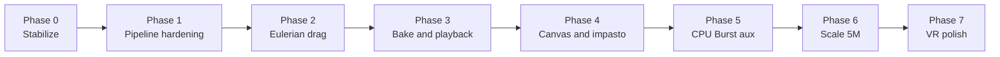

# Full Implementation Plan — Harmonic Drip Engine V3.1

**Source spec:** [`docs/architecure.md`](architecure.md)  
**Current coverage:** ~88% (see [`docs/architecture-coverage.md`](architecture-coverage.md))  
**Branch:** `anas-sandbox`  
**Target:** 100% spec compliance + production-ready VR paint simulation at 1M–5M particles

---

## 1. Current state (baseline)

### Done ✅
| Area | What exists |
|------|-------------|
| Memory layouts | All 4 blittable structs (32 B / 16 B) |
| VRAM buffers | Ping-pong A/B, falling stream, density cache, grid KV, cell ranges |
| 6-stage GPU pipeline | Clear → hash → bitonic sort → cell map → SPH density → integration |
| Trap mitigations | Indirect thread-group fix, two-pass SPH, sort isolation, quantize kernel |
| SPH physics | 27-cell neighbor traversal, cubic spline kernel, pressure + viscosity |
| Orchestrator | `PipelineExecutionController` with indirect dispatches |
| Legacy bridge | `ParticleEmitter` → GPU via `HarmonicGpuEmitterBridge` |
| Simulation control | `SimulationManager` start/pause/reset + kinematic bridge |
| Impasto (base) | `ImpastoCanvasDisplace.shader`, `HighScaleFramePresenter` |
| IO (base) | Async `CompressedDiskWriter`, threaded `SlidingWindowDiskQueue` |
| Tests | ~45 Edit/Play Mode tests, `ArchitectureManifest` contract |

### Remaining gaps ❌ / ⚠️
| Gap | Priority |
|-----|----------|
| Eulerian voxel drag field | **P0** — only major physics feature missing from §1 |
| GPU quantized readback → disk | **P0** — §4.4 PCIe path incomplete |
| Consume-based stream compaction | **P1** — spec §5.3 uses `ConsumeStructuredBuffer` |
| Falling-particle world pass + canvas hit | **P1** — world space after nozzle exit |
| Burst RK4 pendulum integration | **P2** — §7 integrator not Burst-compiled |
| Impasto ↔ paint hit pipeline | **P2** — presenter not wired to `CanvasController` |
| 5M particle stress / profiling | **P1** — capacity exists, never validated |
| VR rendering of GPU particles | **P2** — no visual for internal/falling buffers |
| CI / automated test gate | **P1** — tests exist, not in pipeline |

---

## 2. Implementation principles

1. **Do not break the legacy CPU path** — `UseHarmonicGpuPipeline = false` must keep working.
2. **GPU-first, CPU readback last** — simulation stays VRAM-resident; readback only for bake/playback/debug.
3. **One phase = one mergeable PR** — each phase below is a reviewable unit on `anas-sandbox`.
4. **Every phase ends with tests** — Edit Mode for math/IO; Play Mode for GPU; stress category for scale.
5. **Update `ArchitectureManifest` + coverage doc** when a feature flips to Implemented.

---

## 3. Phased roadmap



---

## Phase 0 — Stabilize & align (1–2 days)

**Goal:** Clean baseline before new features.

| Task | Deliverable |
|------|-------------|
| Sync docs | Update `architecture-coverage.md` checklist to match code (Impasto, RK4, IO already landed) |
| Scene wiring | `MainSimulation`: link `SimulationManager` → `HarmonicPipelineRoot`, bucket kinematic bridge |
| Test gate | All Edit Mode tests green; Play Mode tests green on dev GPU |
| Disable dev seed in prod path | `seedTestParticlesOnStart = false` when external emitter active |
| Branch hygiene | Commit `anas-sandbox`; optional PR to `main` with architecture-only changes |

**Acceptance criteria**
- [ ] Play `MainSimulation`, start sim, particles ingest to GPU without console errors
- [ ] Test Runner: 0 failures Edit Mode
- [ ] `ArchitectureManifest.FeatureMatrix` matches reality

---

## Phase 1 — Pipeline hardening (3–5 days)

**Goal:** Match spec §5.3 / §6 exactly; fix partial implementations.

### 1.1 Consume-based stream compaction
- Refactor `ExecuteInternalFluidIntegration` to use `ConsumeStructuredBuffer` + `AppendStructuredBuffer` as in spec
- Keep `_ActiveParticleCount` guard OR derive count from indirect args slot 3 only
- **Files:** `StreamCompactionPingPong.compute`, `PipelineExecutionController.cs`

### 1.2 Per-particle pseudo-forces
- Pass bucket ω, α into shader; compute non-inertial acceleration per particle using local `Position`/`Velocity` (not bucket origin sample)
- **Files:** `StreamCompactionPingPong.compute`, `LocalSpaceProcessor.cs` (HLSL mirror)

### 1.3 Falling-fluid world pass
- Add **Stage 7** (optional dispatch): integrate falling buffer in world space with gravity + drag (`WorldSpaceProcessor` logic in compute)
- Separate kernel: `ExecuteFallingFluidIntegration` in new or existing shader
- **Files:** new `FallingFluidWorld.compute` or extend `StreamCompactionPingPong.compute`

### 1.4 GPU particle visualization (debug)
- Minimal point/instanced mesh draw from internal + falling buffers (count only, no readback of all particles)
- **Files:** `HarmonicParticleDebugRenderer.cs`, unlit shader

**Acceptance criteria**
- [ ] Internal particle count stable over 1000 frames (no drift/explosion)
- [ ] Falling buffer receives particles through nozzle SDF
- [ ] Play Mode: compaction test with 10k particles
- [ ] Debug renderer shows particle cloud in Scene view

---

## Phase 2 — Eulerian voxel drag field (5–7 days)

**Goal:** Implement §1 “ambient environmental drag field (Eulerian Voxel Grid)”.

### 2.1 Data structures
```csharp
// Domain/Models/VoxelDragCell.cs — 16 bytes
struct VoxelDragCell { float3 Velocity; float Drag; }
```
- 3D grid buffer `_EulerianVelocityGrid` (RWStructuredBuffer)
- Grid dims tied to bucket local bounds or world AABB around canvas

### 2.2 Compute passes
| Pass | Kernel | Purpose |
|------|--------|---------|
| Advect | `AdvectDragGridKernel` | decay + optional wind field |
| Scatter | `ScatterParticleToGridKernel` | splat falling/internal velocity to voxels |
| Sample | `ApplyDragFromGridKernel` | modify particle velocity during integration |

### 2.3 Pipeline integration
- Insert after Stage 4, before Stage 5 (density needs updated positions) OR apply drag in falling pass only
- **Files:** `EulerianDragGrid.compute`, orchestrator bindings, `ArchitectureManifest` update

**Acceptance criteria**
- [ ] Particles slow down in high-drag voxels
- [ ] Edit Mode: grid dimensions / cell size unit tests
- [ ] Play Mode: visible trajectory change with drag coefficient sweep

---

## Phase 3 — Bake & playback pipeline (4–6 days)

**Goal:** Complete §4.4 quantized VRAM cache end-to-end.

### 3.1 GPU → CPU readback (async)
- After `DataCompactionPacker`, use `AsyncGPUReadback.RequestIntoNativeArray` on `_quantizedBakeBuffer`
- Frame header: `{ uint particleCount; uint frameIndex; uint64 timestamp; }` + 16 B × count payload
- **Files:** `HarmonicBakeRecorder.cs`, `QuantizedFrameEncoder.cs`

### 3.2 Disk format
```
/bake/
  manifest.json        # capacity, version, fps, bucket bounds
  frames/
    frame_000001.bin
    frame_000002.bin
```
- `CompressedDiskWriter` writes completed readback chunks (already async)

### 3.3 Playback
- `SlidingWindowDiskQueue` loads N+1 frames on worker thread
- `HighScaleFramePresenter` decodes FP16 relative to bucket origin → height map / particle buffer
- Playback mode on `PipelineExecutionController`: `SimulationMode { Live, BakeRecord, BakePlayback }`

**Acceptance criteria**
- [ ] Record 300 frames @ 60 FPS without stalling main thread > 2 ms avg
- [ ] Playback reproduces particle count per frame ±0
- [ ] Bake size ≈ 16 bytes × N × frames (verify against spec 4.8 GB/s budget at 5M)

---

## Phase 4 — Canvas & impasto integration (3–4 days)

**Goal:** Connect GPU paint to visible canvas art (§1 impasto).

### 4.1 Falling particle → canvas hit
- GPU: when particle crosses canvas plane Y, append to `_CanvasHitBuffer` (compact hits)
- CPU: async readback small hit buffer (not full particle set) → `CanvasController.OnParticleHit` or `HighScaleFramePresenter.StampImpastoAtUv`

### 4.2 Impasto material on scene canvas
- Replace / augment `CanvasController` quad material with `HarmonicEngine/ImpastoCanvasDisplace`
- Drive `_HeightMap` from presenter; keep `_MainTex` albedo from existing paint color logic

### 4.3 Merge legacy + GPU paths
- CPU `ParticleEmitter` hits canvas when GPU off
- GPU path hits canvas via hit buffer when GPU on

**Acceptance criteria**
- [ ] Swinging bucket leaves 3D impasto height on canvas
- [ ] Height persists across frames; reset clears height map
- [ ] Visual parity reasonable vs CPU splat path

---

## Phase 5 — CPU auxiliary systems (2–3 days)

**Goal:** §7 `Rk4SystemSolver` + pendulum on Burst SIMD path.

### 5.1 Burst RK4 pendulum
- `[BurstCompile]` job: `PendulumRk4Job` replacing explicit Euler in `PendulumSimulator` (optional toggle)
- State: `(θ, ω)`; derivative from spec equations in `PendulumSimulator` header comment
- **Files:** `Core/Mathematics/Integrators/Rk4SystemSolver.cs`, `PendulumRk4Job.cs`

### 5.2 Solver abstraction cleanup
- `SphFluidSolverCore` remains GPU-side parameters; document split: CPU vs GPU solvers
- Optional: `IPendulumSolver` for A/B test Euler vs RK4

**Acceptance criteria**
- [ ] RK4 energy drift lower than Euler over 60 s sim (unit test + plot)
- [ ] `HarmonicBucketKinematicBridge` unchanged API

---

## Phase 6 — Scale validation 1M → 5M (3–5 days)

**Goal:** Prove §1 target capacity.

| Milestone | Particle count | Target FPS | Notes |
|-----------|----------------|------------|-------|
| M1 | 100k | 60 | Baseline profile |
| M2 | 500k | 60 | Default high quality |
| M3 | 1M | 30–60 | `maxCapacity` default |
| M4 | 5M | 15–30 | cinematic bake mode |

### Tasks
- Profile each stage with Unity Profiler + RenderDoc
- Tune: `cellSize`, bitonic sort (consider radix for 5M), async readback interval
- Add `[Category("Stress")]` Play Mode tests (run manually, not CI)
- Document hardware minimums in README

**Acceptance criteria**
- [ ] 1M stable ≥ 30 FPS on target dev GPU
- [ ] 5M completes bake record without TDR
- [ ] No monotonic VRAM growth over 10 min

---

## Phase 7 — VR & production polish (4–6 days)

**Goal:** Shippable VR swinging-bucket experience.

| Task | Notes |
|------|-------|
| XR interaction | Grab bucket, start/stop sim from VR UI |
| Performance tiers | Quality preset: Low 100k / Med 500k / High 1M |
| LOD for rendering | GPU particles → mesh / metaball / screen-space splats |
| Error handling | Graceful fallback if `supportsComputeShaders == false` |
| Final QA checklist | Scene load, reset, pause, bake, playback |

**Acceptance criteria**
- [ ] Quest/PC VR target framerate met on chosen tier
- [ ] Full user loop: fill bucket → swing → paint canvas → reset

---

## 4. Testing strategy (continuous)

| Layer | What | When |
|-------|------|------|
| Unit | Struct sizes, math, IO, manifest | Every PR — Edit Mode |
| Integration | Full pipeline 1–32 particles | Every PR — Play Mode |
| GPU regression | Kernel compile, binding smoke | Every PR |
| Stress | 100k–5M | Phase 6 + nightly manual |
| Visual | Canvas impasto screenshot compare | Phase 4+ |

**CI recommendation:** GitHub Action running Unity `-runTests -testPlatform editmode` on push.

---

## 5. File / folder map (final target)

```text
Assets/AdvancedHarmonicEngine_V3/
├── Core/
│   ├── Mathematics/Integrators/Rk4SystemSolver.cs      [Phase 5: Burst]
│   ├── Validation/ArchitectureManifest.cs
│   └── Utilities/IndirectDispatchMath.cs
├── Domain/
│   ├── Models/ (+ VoxelDragCell.cs)                    [Phase 2]
│   ├── Solvers/ (+ EulerianDragSolver.cs)              [Phase 2]
│   └── IO/QuantizedFrameEncoder.cs                       [Phase 3]
├── Infrastructure/
│   ├── ComputeShaders/
│   │   ├── (existing 4)
│   │   ├── EulerianDragGrid.compute                      [Phase 2]
│   │   └── FallingFluidWorld.compute                     [Phase 1]
│   ├── Shaders/ImpastoCanvasDisplace.shader
│   ├── Management/PipelineExecutionController.cs
│   └── PlaybackStreaming/
│       ├── HarmonicBakeRecorder.cs                       [Phase 3: readback]
│       └── HighScaleFramePresenter.cs                    [Phase 4]
└── Testing/

Assets/SwingingPaintBucket/
└── Simulation/SimulationManager.cs                       [Phase 0: wired]
```

---

## 6. Risk register

| Risk | Mitigation |
|------|------------|
| TDR at 5M particles | Indirect args kernel; cap dispatch; split bitonic into passes |
| PCIe saturation on bake | Quantize on GPU; readback every Nth frame; half buffer async |
| Sort cost O(n log² n) | Radix sort fallback at >1M; or spatial hash without full sort |
| VRAM exhaustion | Pool allocator; streaming despawn; configurable `maxCapacity` |
| Legacy CPU path bitrot | Keep `UseHarmonicGpuPipeline` toggle; CI tests both paths |

---

## 7. Suggested timeline

| Phase | Duration | Cumulative |
|-------|----------|------------|
| 0 Stabilize | 1–2 days | 2 days |
| 1 Hardening | 3–5 days | 7 days |
| 2 Eulerian drag | 5–7 days | 14 days |
| 3 Bake/playback | 4–6 days | 20 days |
| 4 Canvas/impasto | 3–4 days | 24 days |
| 5 Burst RK4 | 2–3 days | 27 days |
| 6 Scale 5M | 3–5 days | 32 days |
| 7 VR polish | 4–6 days | **~38 days** |

*Single developer, full-time estimate. Parallel work (render + compute) can shave ~20%.*

---

## 8. Definition of done (100% spec)

The architecture is **fully implemented** when:

1. All items in `ArchitectureManifest.FeatureMatrix` are **Implemented** (none Partial/NotImplemented except explicitly deferred post-V3.1 scope).
2. All kernels listed in `RequiredComputeKernels` exist and are bound in the orchestrator.
3. All assets in §7 blueprint exist and are referenced.
4. `SimulationManager` drives live, bake, and playback modes.
5. 5M particle bake completes on documented reference hardware.
6. Edit + Play Mode tests pass; stress suite documented.
7. `architecture-coverage.md` shows **100%** with no open gaps.

---

## 9. Recommended starting point

**Start with Phase 0 → Phase 1** (stabilize + consume compaction + falling pass).  
These unblock everything else and reduce technical debt before adding Eulerian drag.

**Next action:** Execute Phase 0 scene wiring + Phase 1.1 consume refactor in the next implementation session.
