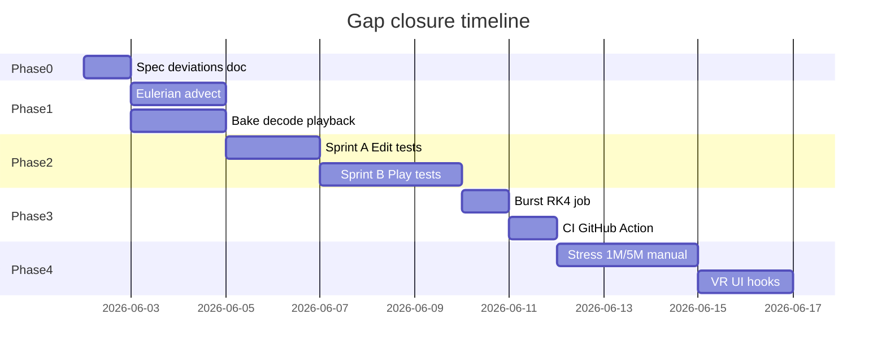

# Gap Closure Plan — Harmonic Engine V3.1

**Goal:** Close all gaps in [`architecture-coverage-todo.md`](architecture-coverage-todo.md) and reach spec-compliant + test-proven state.  
**Spec:** [`architecure.md`](architecure.md)

---

## Phases overview

---

## Phase 0 — Governance (P0)

| ID | Task | Deliverable | Status |
|----|------|-------------|--------|
| 0.1 | Approve stream compaction deviation | [`spec-deviations.md`](spec-deviations.md) | ✅ |
| 0.2 | Link deviation in `ArchitectureManifest` | Comment + manifest row | ✅ |

**Exit criteria:** Deviation documented; no false "100% implemented" claims for consume pattern.

---

## Phase 1 — Implementation gaps (P1)

| ID | Task | Deliverable | Status |
|----|------|-------------|--------|
| 1.1 | Eulerian advect + decay | `AdvectDragGridKernel` in `EulerianDragGrid.compute` | ✅ |
| 1.2 | Wire advect in pipeline | `RunEulerianDragPass` order: advect → scatter → apply | ✅ |
| 1.3 | Bake frame decoder | `QuantizedBakeDecoder.cs` | ✅ |
| 1.4 | Playback → impasto | `HarmonicBakePlaybackDriver` stamps from decoded frames | ✅ |
| 1.5 | Store quantize origin in bake header | Optional 12-byte origin extension in frame header | ⬜ |

**Exit criteria:** Drag field evolves between frames; playback visibly stamps height map from disk frames.

---

## Phase 2 — Automated tests

### Sprint A — Edit Mode

| ID | Test class | Proves | Status |
|----|------------|--------|--------|
| A.1 | `ArchitectureManifestCompletenessTests` | All kernels exist on disk | ✅ |
| A.2 | `QuantizedBakeDecoderTests` | FP16 round-trip matches packer layout | ✅ |
| A.3 | `ImpastoPresenterEditModeTests` | `StampImpastoAtUv` raises height | ✅ |
| A.4 | `IndirectDispatchMathTests` (extend) | Edge cases n=0, n=64, n=65 | ⬜ |

### Sprint B — Play Mode

| ID | Test class | Proves | Status |
|----|------------|--------|--------|
| B.1 | `PipelineStabilityPlayModeTests` | 100 frames, count ≤ capacity | ✅ |
| B.2 | `PipelineIndirectArgsPlayModeTests` | Args buffer sane after CopyCount | ✅ |
| B.3 | `PipelineEulerianDragPlayModeTests` | Drag on/off both stable | ✅ |
| B.4 | `SimulationManagerResetPlayModeTests` | Reset clears impasto height | ✅ |

### Sprint C — Stress (manual CI optional)

| ID | Test | Status |
|----|------|--------|
| C.1 | 100k / 30 frames budget | ⬜ |
| C.2 | 1M / 10 frames | ⬜ |
| C.3 | Bake 300 frames stall | ⬜ |

**Exit criteria:** Edit Mode all green; Play Mode pipeline tests green locally.

---

## Phase 3 — Engineering polish (P2)

| ID | Task | Status |
|----|------|--------|
| 3.1 | `PendulumRk4Job` Burst `IJob` | ✅ |
| 3.2 | GitHub Action `harmonic-editmode-tests.yml` + `RunHarmonicEditModeTests.ps1` | ✅ |
| 3.3 | Optional: `SimulationManager` VR hook interface | ⬜ |

---

## Phase 4 — Scale proof (P1 spec §1)

| Milestone | Target | Status |
|-----------|--------|--------|
| M1 | 100k @ 60 FPS | ⬜ |
| M2 | 500k @ 60 FPS | ⬜ |
| M3 | 1M @ 30 FPS | ⬜ |
| M4 | 5M bake no TDR | ⬜ |

Document results in [`hardware-requirements.md`](hardware-requirements.md).

---

## Tracking

| Document | Update when |
|----------|-------------|
| `architecture-coverage.md` | Phase completes |
| `architecture-coverage-todo.md` | Each 🔲 → ✅ |
| `ArchitectureManifest.cs` | Feature + test land together |

---

## Current session scope

**Implemented (2026-06-02):** Phases 0–3 core + Sprint A/B. **Deferred:** Phase 4 stress, VR hooks (3.3), bake header origin (1.5), consume buffer refactor.
