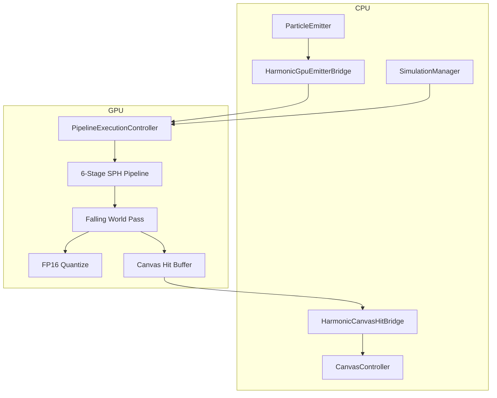
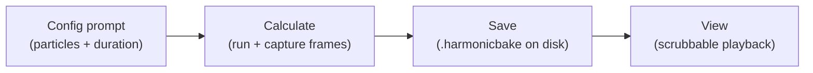

# Harmonic Engine V3 — Unity API Guide

How to integrate and drive **AdvancedHarmonicEngine_V3** from Unity scenes, scripts, and VR UI.

**Related docs:** [`architecure.md`](architecure.md) · [`architecture-coverage.md`](architecture-coverage.md) · [`hardware-requirements.md`](hardware-requirements.md) · [`scenes.md`](scenes.md) · [`configuration-api.md`](configuration-api.md) · [`neighbor-queries-and-spatial-hashing.md`](neighbor-queries-and-spatial-hashing.md) · [`engine-communication.md`](engine-communication.md) · [`paint-color-and-lifecycle.md`](paint-color-and-lifecycle.md) · [`testing-strategy.md`](testing-strategy.md) · [`debugging-and-rendering.md`](debugging-and-rendering.md) · [`architecture-divergences.md`](architecture-divergences.md)

---

## 1. Quick start (5 minutes)

### 1.1 Scene setup

Minimum hierarchy for the sample project:

```text
MainSimulation
├── HarmonicPipelineRoot          → PipelineExecutionController (+ optional HarmonicBakeRecorder)
├── SimulationManager           → SimulationManager (+ HarmonicSimulationControls)
├── Canvas                      → CanvasController + HighScaleFramePresenter
└── SimulationManager/Bucket    → PendulumSimulator, BucketController, ParticleEmitter
                                  + HarmonicGpuEmitterBridge
                                  + HarmonicBucketKinematicBridge
                                  + HarmonicCanvasHitBridge
```

Reference scenes: [`ClassicPaintSimulation.unity`](../Assets/Scenes/ClassicPaintSimulation.unity) (full bucket/canvas flow) and [`HarmonicEngineLab.unity`](../Assets/Scenes/HarmonicEngineLab.unity) (engine timeline lab). See [`scenes.md`](scenes.md).

### 1.2 Inspector wiring

| Component | Assign |
|-----------|--------|
| `SimulationManager.BucketObject` | Bucket GameObject |
| `SimulationManager.HarmonicPipeline` | `HarmonicPipelineRoot` |
| `SimulationManager.Canvas` | Canvas GameObject |
| `SimulationManager.ImpastoPresenter` | `HighScaleFramePresenter` on Canvas |
| `PipelineExecutionController` compute shaders | All `.compute` assets under `Infrastructure/ComputeShaders/` |
| `PipelineExecutionController.bucketTransform` | Bucket transform |

### 1.3 Run

```csharp
// Option A — use SimulationManager (recommended)
simulationManager.StartSimulation();

// Option B — drive pipeline directly
pipeline.SetSimulationActive(true);
pipeline.EnableExternalIngestion(true);
```

Press **Play**. With `autoStartSimulationOnPlay` enabled on `SimulationManager`, simulation starts automatically.

---

## 2. Architecture overview



**Data flow per frame**

1. CPU spawns particles → `AppendParticles` (bucket-local space)
2. GPU: grid → sort → SPH density → SPH integration → ping-pong swap
3. Exiting particles → falling buffer → world integration → canvas hits
4. Optional: quantize falling particles for bake readback

---

## 3. Core API — `PipelineExecutionController`

**Namespace:** `HarmonicEngine.Infrastructure.Management`  
**File:** `Infrastructure/Management/PipelineExecutionController.cs`

Main GPU orchestrator. One instance per scene (typically on `HarmonicPipelineRoot`).

### 3.1 Lifecycle

```csharp
using HarmonicEngine.Infrastructure.Management;
using HarmonicEngine.Domain.Models;
using UnityEngine;

public class MyDriver : MonoBehaviour
{
    public PipelineExecutionController pipeline;

    void Start()
    {
        // Check GPU support first
        if (!HarmonicGpuCapabilityGuard.TryValidate(out string reason))
        {
            Debug.LogWarning(reason);
            return;
        }

        pipeline.SetBucketTransform(bucketTransform);
        pipeline.EnableExternalIngestion(true);
        pipeline.SetSimulationActive(true);
    }

    void Update()
    {
        // Only needed if autoRunPipeline == false
        pipeline.ExecutePipelineFrame(Time.deltaTime);
    }
}
```

| Method / property | Description |
|-------------------|-------------|
| `SetSimulationActive(bool)` | Master on/off for GPU simulation |
| `IsSimulationActive` | Current active flag |
| `EnableExternalIngestion(bool)` | When true, disables dev seed particles; expects `AppendParticles` from emitters |
| `ExecutePipelineFrame(float dt)` | Runs one full GPU frame (called automatically if `autoRunPipeline`) |
| `ClearAllParticles()` | Resets both ping-pong append counters to 0 |
| `GetActiveParticleCount()` | Current internal particle count (append counter readback) |

### 3.2 Particle ingestion

```csharp
using HarmonicEngine.Domain.Adapters;
using HarmonicEngine.Domain.Models;

FluidParticle p = FluidParticleFactory.FromWorldSpawn(
    worldPosition,
    worldVelocity,
    bucketTransform,
    restDensity: 1000f,
    mass: 0f);

var batch = new FluidParticle[] { p };
int written = pipeline.AppendParticles(batch, 1);
// written == 0 if at max capacity
```

| Method | Description |
|--------|-------------|
| `AppendParticles(FluidParticle[] particles, int count)` | CPU write into current read append buffer; returns count actually written |
| `BufferService` | Lower-level access to `HarmonicParticleBufferService` |
| `MaxCapacity` | Current pool size (changes with quality tier) |

### 3.3 Bucket kinematics (non-inertial SPH forces)

Implement or assign `IBucketKinematicProvider`:

```csharp
public class MyKinematicBridge : MonoBehaviour, IBucketKinematicProvider
{
    public Vector3 AngularVelocityWorld { get; private set; }
    public Vector3 AngularAccelerationWorld { get; private set; }
    public Vector3 BucketWorldVelocity { get; private set; }

    void Update()
    {
        // populate from your pendulum / rigid body
    }
}

// Wire once:
pipeline.SetBucketKinematicProvider(kinematicBridge);
pipeline.SetBucketTransform(bucketTransform);
```

### 3.4 Quality & capacity

```csharp
using HarmonicEngine.Infrastructure.Management;

// Presets: Low=100k, Medium=500k, High=1M, Cinematic=5M
pipeline.ApplyQualityTier(HarmonicQualityTier.Medium);

int cap = HarmonicQualityPresets.GetParticleCapacity(HarmonicQualityTier.High);
float targetFps = HarmonicQualityPresets.GetTargetFrameRate(HarmonicQualityTier.High);
```

### 3.5 Simulation modes

```csharp
public enum HarmonicSimulationMode
{
    Live,         // Real-time GPU sim (default)
    BakeRecord,   // Live sim + HarmonicBakeRecorder writes FP16 frames
    BakePlayback  // Playback driver reads disk (live sim paused)
}

pipeline.SetSimulationMode(HarmonicSimulationMode.Live);
```

### 3.6 Canvas & falling particles

```csharp
pipeline.SetCanvasPlaneY(canvasTransform.position.y);

uint fallingCount = pipeline.LastFallingQuantizeCount;
uint hitCount = pipeline.LastCanvasHitCount;

if (pipeline.TryGetCanvasHitBuffer(out ComputeBuffer hits, out uint count))
{
    // Prefer HarmonicCanvasHitBridge for async readback + splats
}

if (pipeline.TryGetFallingParticleBuffer(out ComputeBuffer falling, out uint n))
{
    // For debug rendering only — avoid full CPU readback
}
```

#### World-falling ("god mode") & floor response

For free-fall demos (no bucket, no paint canvas) particles can fall through the world and
either be culled at the canvas plane (paint mode) or rest on it as a solid floor.

```csharp
pipeline.SetWorldFallingOnly(true);     // skip SPH/bucket passes, integrate falling particles only
pipeline.EnableExternalIngestion(true); // particles come from an emitter, not the dev seed
pipeline.SetCanvasCullingEnabled(false);// false = solid floor (keep particles), true = paint canvas (cull on hit)
pipeline.SetCanvasPlaneY(-2f);          // the floor / canvas height in world Y
pipeline.SetFloorResponse(restitution: 0f, friction: 0.85f); // bounce / horizontal damping on contact
```

| Method / property | Description |
|-------------------|-------------|
| `SetWorldFallingOnly(bool)` / `WorldFallingOnly` | Toggle the gravity-only world pass (no SPH/bucket) |
| `SetCanvasCullingEnabled(bool)` / `CanvasCullingEnabled` | `true` removes particles into the canvas-hit buffer on plane contact; `false` keeps them on a solid floor |
| `SetFloorResponse(float restitution, float friction)` | Floor bounce (`0`=stop, `1`=full bounce) and horizontal velocity retained on contact |

The shader uniforms behind these are `_CanvasCullingEnabled`, `_FloorRestitution`, `_FloorFriction`
in `FallingFluidWorld.compute`.

#### Pipeline diagnostics (verbose)

`PipelineExecutionController` can emit detailed per-stage diagnostics through the AOP hub:

| Field | Effect |
|-------|--------|
| `verbosePipelineDiagnostics` | Master switch for per-stage + position-sample events |
| `frameDiagnosticInterval` | Throttle: frame summary is logged every N frames (plus on count/hit changes) |
| `positionSampleInterval` / `positionSampleCount` | Read back N particle positions every M frames to verify the GPU buffer independently of rendering |

New diagnostic event types: `HarmonicDiagnosticEventType.PipelineStage` and `ShapeEmit`.

### 3.7 Debug / bake buffers

| Property | Description |
|----------|-------------|
| `QuantizedBakeBuffer` | GPU structured buffer of FP16 bake particles (after quantize pass) |
| `LastFallingQuantizeCount` | Particle count used in last quantize dispatch |
| `PaddedSortSize` | Power-of-two sort buffer size |
| `TryGetInternalParticleBuffer` | Debug draw internal bucket particles |

### 3.8 Test / programmatic bootstrap

```csharp
pipeline.ConfigureAndInitialize(
    argumentShader,
    spatialShader,
    streamShader,
    dataShader,
    capacity: 8192,
    externalIngestion: true,
    autoRun: false,
    fallingShader: fallingFluidWorldShader,   // optional
    eulerianShader: eulerianDragGridShader);  // optional
```

---

## 4. High-level API — `SimulationManager`

**Namespace:** `SwingingPaintBucket.Simulation`  
**File:** `SwingingPaintBucket/Scripts/Simulation/SimulationManager.cs`

Recommended entry point for gameplay and VR UI.

```csharp
using SwingingPaintBucket.Simulation;
using HarmonicEngine.Infrastructure.Management;

public class GameFlow : MonoBehaviour
{
    public SimulationManager sim;

    public void OnStartButton()  => sim.StartSimulation();
    public void OnPauseButton() => sim.PauseSimulation();
    public void OnResetButton()  => sim.ResetSimulation();

    public void SetLowQuality()  => sim.SetQualityTier(HarmonicQualityTier.Low);
    public void StartBake()      => sim.SetSimulationMode(HarmonicSimulationMode.BakeRecord);
    public void StartPlayback()  => sim.SetSimulationMode(HarmonicSimulationMode.BakePlayback);
    public void BackToLive()     => sim.SetSimulationMode(HarmonicSimulationMode.Live);
}
```

| Method | Effect |
|--------|--------|
| `StartSimulation()` | Enables GPU pipeline (if `UseHarmonicGpuPipeline`) |
| `PauseSimulation()` | Disables GPU pipeline |
| `ResetSimulation()` | Resets pendulum, bucket, CPU/GPU particles, canvas, impasto height |
| `SetQualityTier(tier)` | Applies capacity preset on pipeline |
| `SetSimulationMode(mode)` | Live / bake record / bake playback |

**Auto-wiring on `Start()`:** creates GPU bridges, binds canvas hit path, falls back to CPU particles if GPU unsupported.

---

## 5. Legacy emitter integration

**Namespace:** `SwingingPaintBucket.Particles`

### 5.1 `ParticleEmitter`

Set on bucket GameObject:

```csharp
emitter.UseHarmonicGpuPipeline = true;
emitter.HarmonicPipeline = pipeline;  // auto-wired by SimulationManager
```

When GPU mode is on, CPU integration and canvas hits are skipped; GPU path handles physics and `HarmonicCanvasHitBridge` handles canvas.

### 5.2 `HarmonicGpuEmitterBridge`

```csharp
bridge.Bind(pipeline, bucketTransform);
bridge.TryIngestSpawn(worldPos, worldVelocity, restDensity);
```

Called internally by `ParticleEmitter` each spawn.

### 5.3 `HarmonicBucketKinematicBridge`

Feeds pendulum ω, α, and bucket velocity to SPH pseudo-forces. Auto-added by `SimulationManager`.

### 5.4 `HarmonicCanvasHitBridge`

Async GPU readback of compact canvas hits → `CanvasController.OnParticleHit` + impasto stamps. Auto-added by `SimulationManager`.

---

## 6. Canvas & impasto

### 6.1 `CanvasController`

```csharp
using SwingingPaintBucket.Canvas;

canvas.OnParticleHit(worldPosition, paintColor, viscosity);
canvas.ClearCanvas();
canvas.ConfigureImpasto(impastoPresenter);

if (canvas.TryWorldToUv(worldPosition, out Vector2 uv))
{
    // map world hit to 0..1 UV on quad
}
```

Uses `HarmonicEngine/ImpastoCanvasDisplace` shader when `useImpastoShader` is enabled.

### 6.2 `HighScaleFramePresenter`

```csharp
using HarmonicEngine.Infrastructure.PlaybackStreaming;

presenter.StampImpastoAtUv(uv, radius: 8f, intensity: 0.2f);
presenter.ClearHeightMap();
presenter.BindRenderer(canvasRenderer, impastoMaterial);
```

---

## 7. Bake & playback

### 7.1 Record

Add `HarmonicBakeRecorder` to pipeline root:

```csharp
recorder.recordEveryFrame = true;
recorder.recordEveryNthFrame = 2;
// Writes to Application.persistentDataPath/HarmonicBakeFrames/frame_XXXXXX.bin
```

Frame format: 16-byte header + 16 bytes × particle count (see `QuantizedFrameEncoder`).

### 7.2 Playback

Add `HarmonicBakePlaybackDriver`:

```csharp
sim.SetSimulationMode(HarmonicSimulationMode.BakePlayback);
playback.ResetPlayback();
```

---

## 7A. Volume emission (fill a 3D shape with particles)

Distribute a particle count **uniformly through a 3D shape's volume** and send that initial
state to the engine in one shot. Useful for "drop a blob/box/sphere of fluid" scenarios.

### 7A.1 Pure samplers — `HarmonicEngine.Domain.Adapters`

Deterministic, engine-independent uniform volume sampling (unit-tested):

```csharp
using HarmonicEngine.Domain.Adapters;
using Unity.Mathematics;

var positions = new float3[count];

// Solid primitives (uniform by volume, not just surface):
ShapeVolumeSampler.SampleBox(center, fullSize, rotation, count, seed, positions);
ShapeVolumeSampler.SampleSphere(center, radius, count, seed, positions);
ShapeVolumeSampler.SampleCapsule(center, radius, height, rotation, count, seed, positions);

// Arbitrary triangle mesh (rejection sampling + robust ray-parity inside test):
MeshVolumeSampler.SampleInsideMesh(worldBounds, worldVertices, triangles,
    count, seed, maxAttemptsPerPoint, positions);
bool inside = MeshVolumeSampler.IsPointInsideMesh(point, worldVertices, triangles);
```

| API | Notes |
|-----|-------|
| `ShapeVolumeSampler.SampleBox/Sphere/Capsule` | Uniform-by-volume, deterministic for a given `seed`; returns count written (clamped to buffer length) |
| `MeshVolumeSampler.SampleInsideMesh` | Fills any closed mesh; may return fewer points if attempts are exhausted |
| `MeshVolumeSampler.IsPointInsideMesh` | Möller–Trumbore ray-parity test with a skewed ray (avoids axis-aligned edge degeneracies) |

### 7A.2 `ShapeVolumeEmitter` — `SwingingPaintBucket.Scene`

MonoBehaviour that samples the shape and appends the particles to the pipeline.

```csharp
emitter.SetPipeline(pipeline);
emitter.Configure(ShapeVolumeType.Sphere, count: 4096, randomSeed: 12345u,
    emitOnStartValue: false, clearBeforeEmitValue: true, activateSimulationOnEmitValue: true);
emitter.SetSphere(1.5f);
int appended = emitter.Emit();   // samples → builds FluidParticles → AppendParticles
```

`shapeType` supports `Box`, `Sphere`, `Capsule`, `Mesh`. For `Mesh`, assign a `MeshFilter`
(the mesh must be read/write enabled). Emits a `ShapeEmit` diagnostic event with the
requested/sampled/appended counts. Set `emitOnStart=false` when an external director controls timing.

---

## 7B. Simulation timeline — record → save → scrub ("YouTube" workflow)

Calculate a fixed-duration simulation, save it to disk, then replay it with a scrubbable
timeline. Driven by `SimulationTimelineDirector` (`SwingingPaintBucket.Simulation`).



### 7B.1 `SimulationTimelineDirector`

On scene load it shows an on-screen prompt asking for **number of particles**, **duration
(seconds)**, and a **Save calculation** toggle. Behaviour branches on that toggle:

- **Save ON** — every frame is recorded to a `SimulationCaptureStore`. The bottom scrubber appears
  *immediately* and you can **walk through the already-calculated frames while it is still
  calculating** (the cyan "buffered" fill grows toward the live edge). A `⇥ Live` button jumps back
  to the live edge; `❚❚ Pause`/`▶ Play` freeze or resume. When the duration is reached the
  pipeline stops, the capture is saved to disk (`[Saved] ✓ saved`), and the full timeline is
  scrubbable.
- **Save OFF** — the simulation just runs live for the duration (top "Running… N%" banner, no tape,
  no scrubber, no file), then stops.

In both cases the simulation **ends after the requested duration**.

| Field | Description |
|-------|-------------|
| `pipeline` / `shapeEmitter` / `timelineRenderer` / `liveDebugRenderer` | Auto-found via `FindFirstObjectByType` if unset |
| `defaultParticleCount` / `defaultDurationSeconds` / `defaultSaveCalculation` | Prefilled prompt values |
| `captureFps` | Frames captured per simulated second (default 30) |
| `maxRecordedFrames` | Safety cap on memory/disk |
| `autoBeginOnStart` | Skip the prompt and run with defaults (kiosk / VR / automated runs) |
| `captureSubDirectory` | Folder under `Application.persistentDataPath` for saved captures |
| `BeginCalculation()` | Public trigger so VR UI can start the run |

While saving, the live `HarmonicParticleDebugRenderer` is disabled and the view is driven entirely
by the captured tape so scrubbing and the live edge stay consistent. In run-only mode the live
renderer stays on.

### 7B.2 `SimulationCaptureStore` — the tape

Random-access store of recorded frames (particle world positions) with binary save/load.

```csharp
using HarmonicEngine.Infrastructure.PlaybackStreaming;

var store = new SimulationCaptureStore(captureFps: 30f);
store.AddFrame(positions, count, timeSeconds);   // during calculate
store.SaveToFile(path);                           // save (.harmonicbake)

SimulationCaptureStore loaded = SimulationCaptureStore.LoadFromFile(path);
int frame = loaded.FrameIndexForTime(playheadSeconds);   // scrub
float3[] pts = loaded.GetFramePositions(frame);
```

File format: `"HBK1"` magic, capture fps, frame count, then per frame
`time, count, count×float3` positions.

### 7B.3 `SimulationTimelineRenderer` — send a frame to the view

Draws one recorded frame as GPU points (reuses `HarmonicEngine/ParticleDebugPoints`),
independent of the live pipeline buffers.

```csharp
timelineRenderer.Display(store.GetFramePositions(frame), store.GetFrameParticleCount(frame));
timelineRenderer.Hide();
```

---

## 8. GPU capability guard

```csharp
if (HarmonicGpuCapabilityGuard.IsGpuPipelineSupported)
{
    // safe to use pipeline
}

if (!HarmonicGpuCapabilityGuard.TryValidate(out string reason))
{
    // fall back to CPU ParticleEmitter path
}
```

Requirements: compute shaders supported, ≥ 8 compute buffer bindings.

---

## 9. Desktop controls (sample)

`HarmonicSimulationControls` on `SimulationManager`:

| Key | Action |
|-----|--------|
| Space | Start |
| P | Pause |
| R | Reset |
| 1–4 | Quality tier |
| B | Bake record mode |
| V | Bake playback mode |
| L | Live mode |

For VR, call the same `SimulationManager` methods from your UI events.

---

## 10. Domain types reference

### `FluidParticle` (32 bytes, GPU)

```csharp
public struct FluidParticle
{
    public float3 Position;   // local (internal) or world (falling)
    public float Density;
    public float3 Velocity;
    public float Pressure;
}
```

### `FluidParticleFactory`

| Method | Use |
|--------|-----|
| `FromWorldSpawn(...)` | Emitter spawns in world space → converts to bucket local |
| `FromLocalSpawn(...)` | Direct local-space spawn |

### `SphFluidSolverCore`

Inspector-serialized SPH constants on `PipelineExecutionController` (mass, gas constant, rest density, viscosity). Used for GPU uniform uploads.

---

## 11. Compute shader assets

Assign these on `PipelineExecutionController`:

| Field | Asset path |
|-------|------------|
| `argumentUtilityShader` | `Infrastructure/ComputeShaders/ArgumentUtility.compute` |
| `spatialHashGridShader` | `Infrastructure/ComputeShaders/SpatialHashGridIndirect.compute` |
| `streamCompactionShader` | `Infrastructure/ComputeShaders/StreamCompactionPingPong.compute` |
| `dataCompactionShader` | `Infrastructure/ComputeShaders/DataCompactionPacker.compute` |
| `fallingFluidWorldShader` | `Infrastructure/ComputeShaders/FallingFluidWorld.compute` |
| `eulerianDragGridShader` | `Infrastructure/ComputeShaders/EulerianDragGrid.compute` (optional) |

---

## 12. Common patterns

### Custom spawner (no ParticleEmitter)

```csharp
void SpawnBurst(Vector3 worldPos, Vector3 vel, int count)
{
    var particles = new FluidParticle[count];
    for (int i = 0; i < count; i++)
    {
        particles[i] = FluidParticleFactory.FromWorldSpawn(
            worldPos, vel, bucket, restDensity: 1000f, mass: 0f);
    }
    pipeline.AppendParticles(particles, count);
}
```

### Manual single-frame step (tests)

```csharp
pipeline.ConfigureAndInitialize(/* shaders */, capacity: 4096, externalIngestion: true, autoRun: false);
pipeline.SetSimulationActive(true);
pipeline.AppendParticles(seed, seed.Length);
pipeline.ExecutePipelineFrame(0.016f);
Assert.Greater(pipeline.GetActiveParticleCount(), 0u);
```

### Disable GPU at runtime

```csharp
sim.UseHarmonicGpuPipeline = false;
sim.PauseSimulation();
emitter.UseHarmonicGpuPipeline = false;
// CPU path in ParticleEmitter handles physics + canvas
```

---

## 13. Troubleshooting

| Symptom | Check |
|---------|-------|
| No particles | `SetSimulationActive(true)`, `EnableExternalIngestion(true)`, bucket has paint |
| Particles explode | Reduce `cellSize`, check kinematic provider wired |
| No canvas paint | `HarmonicCanvasHitBridge` present, `canvasPlaneY` matches canvas Y |
| Bake files empty | Falling particles must exist; enable `BakeRecord` mode + `HarmonicBakeRecorder` |
| Timeline prompt never starts the sim | `ShapeVolumeEmitter.emitOnStart` must be `false`; `SimulationManager.autoStartSimulationOnPlay` should be `false` so the director owns the pipeline |
| Scrubber shows nothing in playback | `SimulationTimelineRenderer` needs the `HarmonicEngine/ParticleDebugPoints` shader; live `HarmonicParticleDebugRenderer` is disabled during playback by design |
| Input errors in Play | Project uses Input System; use `HarmonicSimulationControls` or call `SimulationManager` from code |
| TDR / freeze at high tier | Lower quality tier; see `hardware-requirements.md` |

---

## 14. Namespaces cheat sheet

| Namespace | Contents |
|-----------|----------|
| `HarmonicEngine.Infrastructure.Management` | Pipeline, quality, modes, GPU guard |
| `HarmonicEngine.Domain.Models` | `FluidParticle`, grid structs, hits |
| `HarmonicEngine.Domain.Adapters` | `FluidParticleFactory`, `ShapeVolumeSampler`, `MeshVolumeSampler` |
| `HarmonicEngine.Domain.Solvers` | SPH core, local/world processors |
| `HarmonicEngine.Domain.IO` | Bake encoder, disk writer |
| `HarmonicEngine.Infrastructure.PlaybackStreaming` | Impasto, bake record/playback, debug + timeline renderers, `SimulationCaptureStore` |
| `SwingingPaintBucket.Simulation` | `SimulationManager`, controls, `SimulationTimelineDirector` |
| `SwingingPaintBucket.Particles` | Emitter bridges |
| `SwingingPaintBucket.Scene` | `ShapeVolumeEmitter`, rain/scene bootstrap |
| `SwingingPaintBucket.Canvas` | Canvas + splats |

---

## 15. Validation

Run automated tests: **Window → General → Test Runner**

- **Edit Mode** — struct layouts, math, IO, manifest, kernel presence  
- **Play Mode** — GPU append, pipeline frames  
- **Category = Stress** — manual high-capacity runs  

See [`architecture-coverage-todo.md`](architecture-coverage-todo.md) for the full test backlog.
