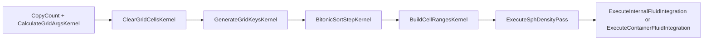

# Neighbor Queries and Spatial Hashing

How the Harmonic Engine finds **nearest particles** for SPH on the GPU.

**See also:** [`architecure.md`](architecure.md) §3 · [`configuration-api.md`](configuration-api.md) · [`Include/SphNeighborQuery.hlsl`](../Assets/AdvancedHarmonicEngine_V3/Infrastructure/ComputeShaders/Include/SphNeighborQuery.hlsl)

---

## Overview

SPH needs every particle’s neighbors within smoothing radius **h**. The engine uses a **sorted spatial hash**, not a fixed 3D grid:

1. Hash each particle’s cell coordinate into a power-of-two bucket table.
2. Bitonic-sort `(hash, particleIndex)` pairs so same-cell particles are contiguous.
3. Build per-hash `[start, end]` ranges into a lookup buffer.
4. For each particle, visit the **27 neighboring cells** (3×3×3 stencil), iterate each cell’s range, reject pairs beyond **2h**.

All neighbor iteration lives in **`ForEachNeighbor`** inside [`SphNeighborQuery.hlsl`](../Assets/AdvancedHarmonicEngine_V3/Infrastructure/ComputeShaders/Include/SphNeighborQuery.hlsl). Shared structs and hash math are in [`SphCommon.hlsl`](../Assets/AdvancedHarmonicEngine_V3/Infrastructure/ComputeShaders/Include/SphCommon.hlsl).

---

## Pipeline per frame

Orchestration: `PipelineExecutionController.BuildSpatialHashGrid` → SPH kernels in [`StreamCompactionPingPong.compute`](../Assets/AdvancedHarmonicEngine_V3/Infrastructure/ComputeShaders/StreamCompactionPingPong.compute).

| Stage | Kernel | Shader file |
|-------|--------|-------------|
| Args | `CalculateGridArgsKernel` | `ArgumentUtility.compute` |
| Clear | `ClearGridCellsKernel` | `SpatialHashGridIndirect.compute` |
| Hash | `GenerateGridKeysKernel` | `SpatialHashGridIndirect.compute` |
| Sort | `BitonicSortStepKernel` | `SpatialHashGridIndirect.compute` |
| Ranges | `BuildCellRangesKernel` | `SpatialHashGridIndirect.compute` |
| Density | `ExecuteSphDensityPass` | `StreamCompactionPingPong.compute` |
| Forces | `ExecuteInternalFluidIntegration` / `ExecuteContainerFluidIntegration` | `StreamCompactionPingPong.compute` |

---

## Grid sizing

| Parameter | Source | Meaning |
|-----------|--------|---------|
| `cellSize` | `PipelineExecutionController` | World spacing for `floor(pos / cellSize)` |
| `h` (smoothing radius) | `SphFluidSolverCore.SmoothingRadius(cellSize)` | Default **2× cellSize** |
| `_paddedSortSize` | `NextPowerOfTwo(maxCapacity)` | Max hash table size |
| `_frameSortSize` | Dynamic when enabled | Clamped `NextPowerOfTwo(activeCount)` |

`_GridResolution` is the **hash bucket count** (power of two), not a spatial cell count. Collisions fold via XOR + mask.

---

## GPU buffers

| Buffer | Role |
|--------|------|
| `_GridKeyValueBuffer` / `_SortedGridKeyValueBuffer` | `(cellHash, particleIndex)` sorted by hash |
| `_CellStartEndBuffer` | Per-hash index range into sorted buffer |
| `_ReadOnlyParticleSource` | Positions for hash + density pass |
| `_DensityWritableCache` | Density/pressure written in pass 1, read in pass 2 |

C# readback (tests/diagnostics): `PipelineExecutionController.TryGetSpatialHashBuffers`.

---

## Adding a new kernel that queries neighbors

1. Run the existing grid build (`BuildSpatialHashGrid` happens inside `ExecutePipelineFrame`).
2. `#include "Include/SphCommon.hlsl"` then `#include "Include/SphNeighborQuery.hlsl"`.
3. Declare the required buffers/uniforms (see header comment in `SphNeighborQuery.hlsl`).
4. Call `ForEachNeighbor(particleIndex, self, useDensityCache, ...)`.

Do **not** duplicate hash or stencil logic — grid build and neighbor query must use the same `SphHashCell` / `SphHashPosition` functions.

---

## Two-pass SPH

| Pass | `useDensityCache` | Computes |
|------|-------------------|----------|
| Density | `false` | ρ only (reads `_ReadOnlyParticleSource`) |
| Integration | `true` | Pressure gradient + viscosity (+ optional color diffusion) |

Distance cutoff: `r > 2.0 * h` (cubic spline support).
